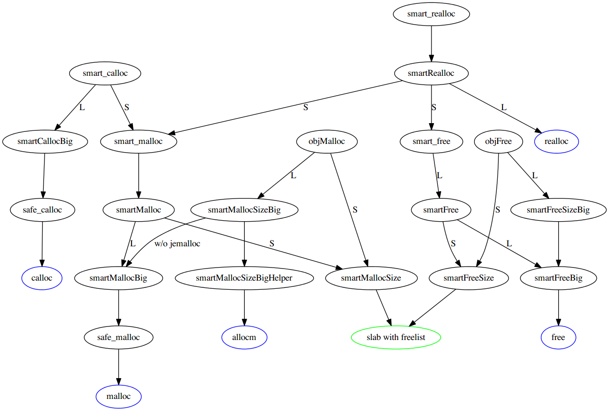
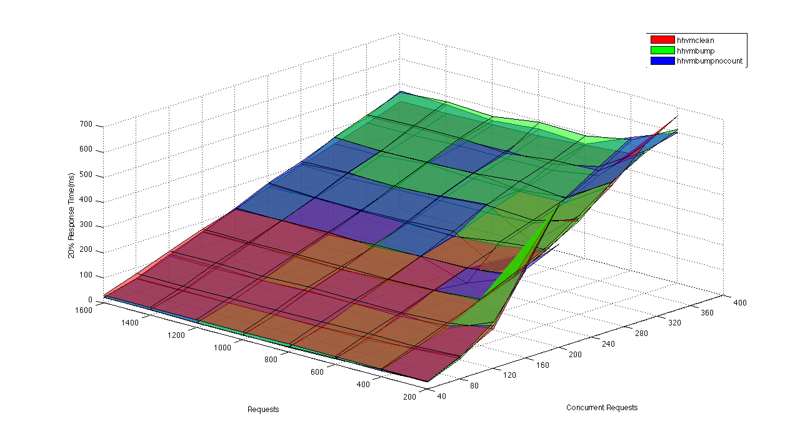
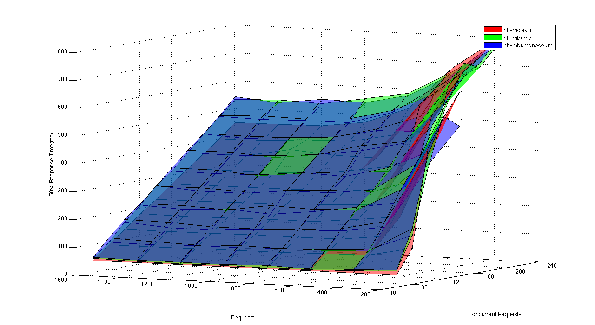
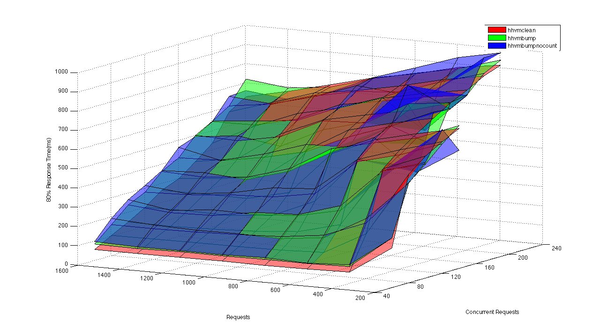
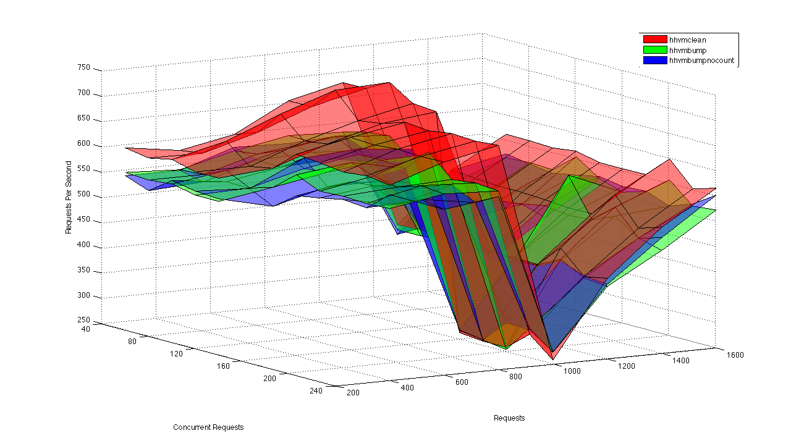
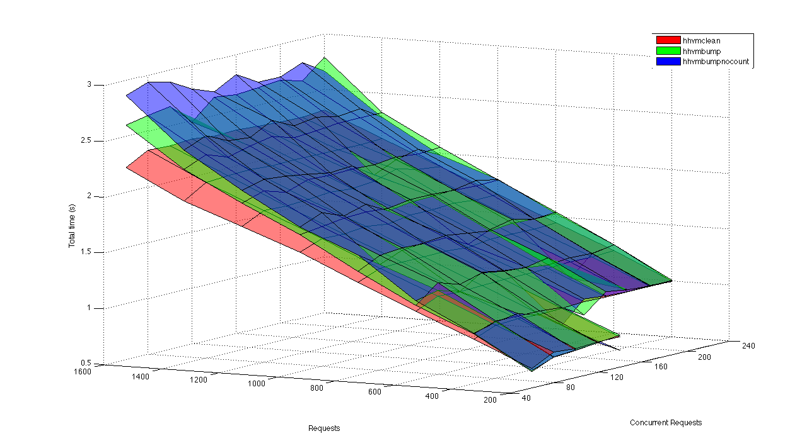

#HipHop VM Notes

##Reference Counting
The semantics of the PHP language require [reference counting][php_refcounting] to be immediate, specifically in relation to the passing and copying of arrays (Copy on Write semantics). This obviously causes some major performance penalties as each PHP reference mutation requires the destination objects reference count to be modified.

###Reference counting in C++ 
Parallel to the reference counting operations performed in HHVM's JIT there is another reference counting infrastructure involving precompiled C++ code. This will be referred to as the C++ Reference Counting. 

This type of reference counting is primarily implemented by the calling of various macro's defined in [countable.h][countable.h] by various counted classes (different macros exist for non-static and potentially-static reference counted objects). The macros operate on a `int_32t` field named `m_count` which is defined in each of the various reference counted classes. It is asserted that this field is at a 12 byte offset from the start of the object as defined by the `FAST_REFCOUNT_OFFSET` constant in [types.h][types.h]. A atomic variant of m_count is defined in [countable.h][countable.h].

Unfortunately there are multiple places in the code base where reference counting is reimplemented (ie. where [countable.h][countable.h] is not used) and m_count is directly manipulated. For the purpose of removing reference counting many of these occurrences were removed/modified in [this commit][inconsistant_refcounting_commit]. While some of these occurrences may be required for the VM to behave properly there are certainly cases where, for consistencies sake, the present reference counting infrastructure should have been used.

While its behavior was analysed as part of this project, [ref-data.h][ref-data.h] appears to be a special case with regards to reference counting. It acts as a compatibility layer between the ZendPHP and HipHopVM implementation of RefData's and manipulates its apparent reference count in a non standard fashion

###Reference counting in the JIT
When code is executed using the JIT a new set of reference counting functions become involved. These can be found in [code-gen-x64.cpp][cg-x64], [code-gen-helpers-x64.cpp][cgh-x64] and their respective ARM equivalents. The modification of these functions such that they perform no operation seems to disable reference counting in the JIT (this can observed by analysing the IR emitted by hhvm's printir trace). A list of these functions follows:

####[code-gen-helpers-x64.cpp][cgh-x64]
 + void emitIncRef(Asm& as, PhysReg base)
 + void emitIncRefCheckNonStatic(Asm& as, PhysReg base, DataType dtype)
 + void emitIncRefGenericRegSafe(Asm& as, PhysReg base, int disp, PhysReg tmpReg)

####[code-gen-x64.cpp][cg-x64]
 + `void CodeGenerator::cgIncRefWork(Type type, SSATmp* src)`
 + `void CodeGenerator::cgIncRef(IRInstruction* inst)`
 + `void CodeGenerator::cgIncRefCtx(IRInstruction* inst)`
 + `void CodeGenerator::cgDecRefStack(IRInstruction* inst)`
 + `void CodeGenerator::cgDecRefThis(IRInstruction* inst)`
 + `void CodeGenerator::cgDecRefLoc(IRInstruction* inst)`
 + `void CodeGenerator::cgGenericRetDecRefs(IRInstruction* inst)`
 + ```template <typename F> Address CodeGenerator::cgCheckStaticBitAndDecRef(Type type, 
 			PhysReg dataReg, Block* exit, F destroy)```
 + `void CodeGenerator::cgDecRefStaticType(Type type, PhysReg dataReg, Block* exit, bool genZeroCheck)`
 + `void CodeGenerator::cgDecRefDynamicType(PhysReg typeReg, PhysReg dataReg, Block* exit, bool genZeroCheck)`
 + `void CodeGenerator::cgDecRefDynamicTypeMem(PhysReg baseReg, int64_t offset, Block* exit)`
 + `void CodeGenerator::cgDecRefMem(Type type, PhysReg baseReg, int64_t offset, Block* exit)`
 + `void CodeGenerator::cgDecRefMem(IRInstruction* inst)`
 + `void CodeGenerator::cgDecRefWork(IRInstruction* inst, bool genZeroCheck)`
 + `void CodeGenerator::cgDecRef(IRInstruction *inst)`
 + `void CodeGenerator::cgDecRefNZ(IRInstruction* inst)`

This is may not be an exhaustive list of the functions involved; it simply lists those that were identified and modified in the process of disabling reference counting. There exists other sections of the JIT where reference counting is performed (through the direct manipulation of the data at an objects `FAST_REFCOUNT_OFFSET`) and these can be in [this branch comparison][norefcount-master-compare].

Some pairs of reference counting operations can be [omitted][refcount-opts.cpp] by the JIT if proven to not affect the overall reachability of objects.

###PHP Semantics and Reference Counting:
The PHP language mandates pass-by-value semantics which naively implemented incurs a relativity large performance penalty. In order to optimise this requirement (particularly in the case of arrays) PHP engines implement copy-on-write arrays. That is if the variable is assigned the value of an array, that array will only be copied in memory at the time a write is made to it. This requires knowledge of the number of references to an object (exact reference counting) and as such causes issues when reference counting is removed from the system.

The behavior of [array-data.cpp][array-data.cpp] depends highly on the result of the function `bool hasMultipleRefs() const` (as defined in [countable.h][countable.h]) which, in an environment without exact reference counting, will not return a realistic value. If the function always returns `true` arrays will likely be needlessly copied on mutation  resulting in a performance penalty. If it always returns `false` then arrays which should exist separately may still resolve to the same object. The actual behavior in these circumstances remains untested and as such these comments may not reflect reality.

While not throughly investigated it appears strings ([string-data.h][string-data.h]) perform similar optimisations when mutated.

##Memory Management
Memory management within HHVM is split into several different varieties. 

1. At the lowest level we have raw calls to `malloc`, `free` and friends. The
   default build for HHVM is to use _jemalloc_ instead of system `malloc`.
   
   Memory chunks allocated using these commands are typically internal C++
   objects, but sometimes they are used for PHP objects (certain types of
   strings) as an optimisation.
   
2. We have the so-called "Smart Memory Manager", written in C++ and backed by
   2MB 'slabs' allocated with `malloc`. The Smart Memory Manager is thread-local
   and functions similarly to a 'reap' (heap-region).

The way that both allocation types are mixed and matched within HHVM makes it
difficult at times to figure out what is going on.

The Smart Memory Manager itself handles three different types of requests,
documented in [memory-manager.cpp][memory-manager.cpp]:

 - Large allocations. These fall through to the associated 'Big' variants of the
   functions, and are tracked on their own sweep list. They are managed directly
   using the system functions (`malloc`, `free`, `allocm`). A large allocation
   is one that is larger than 2K in size.
 - Known-size small allocations. These are managed directly using the back-end
   functions, which is troublesome, but presumably an optimisation of some
   sort. For example, certain objects are allocated using `objMalloc` and
   `objFree`, which utilise the back-end functions. These call the 'size'
   functions directly in [memory-manager-inl.h](memory-manager-inl.h), and by
   bypassing the front-facing API they are not put onto the sweepable object
   list, and are expected to free themselves automatically, usually via
   reference-counted destruction, invoking the `smartFreeSize` functions. They
   may also be forgotten at request end, when the memory manager resets the
   slabs.
 - Unknown-size small allocations. These are allocated onto the slab and freed
   onto a freelist. In the case that the allocation is actually a large one, it
   falls through to the 'large allocations' category. This category of
   allocations is managed by the front-facing functions (`smart_malloc`,
   `smart_free`, `smartMalloc`, etc) located in
   [memory-manager.cpp](memory-manager.cpp). They are used for the majority of
   allocations.



At the conclusion of a request `void hphp_session_exit()` is executed ([program-functions.cpp][program-functions.cpp]). This function is responsible for calling the `Sweepable::sweep()`([sweepable.h][sweepable.h]) method of all enlisted sweepable objects via `MemoryManager::sweep()` ([memory-manager.cpp][memory-manager.cpp]) and calls `MemoryManager::resetAllocator()` (also in [memory-manager.cpp][memory-manager.cpp]).
`MemoryManager::resetAllocator()` is responsible for freeing the slabs allocated by the memory manager, deallocates non-persistent large allocations and sweeps the enlisted strings.

##Profiling/Instrumentation 

###IR Tracing
HHVM can be configured to output the IR (Intermediate Representation) of each function it encounters. This is enabled by running HHVM in an environment where `TRACE=printir:2` is enabled. The trace will be found in `/tmp/hphp.log`. The JIT emitted assembly can also be output alongside the IR, but this requires HHVM to be compiled against libxed (which can be found in the tarball for [Intel PIN][intel_pin]). The subsequent cmake command is:
```cmake -DCMAKE_BUILD_TYPE=Debug 
 -DLibXed_INCLUDE_DIR=/home/benjamin/Downloads/pin-2.13-62141-gcc.4.4.7-linux/extras/xed2-intel64/include
 -DLibXed_LIBRARY=/home/benjamin/Downloads/pin-2.13-62141-gcc.4.4.7-linux/extras/xed2-intel64/lib/libxed.a```

###Jemalloc Memory Profiler Dump
The jemalloc memory profiler can be accessed through hhvm, while running in server mode through the admin interface.

For this, jemalloc must be compiled with the profiler enabled.  
`./configure --prefix=$CMAKE_PREFIX_PATH --enable-prof`

Start the hhvm in server mode, and assign an admin port. Start the jemalloc profiler:  
`GET http://hhvmserverip:adminport/jemalloc-prof-activate`  
If you get Error 2 at this point, it means you didn't compile jemalloc with the profiler enabled.

And then you can also get a jemalloc memory profiler dump by:  
`GET http://hhvmserverip:adminport/jemalloc-prof-dump`

If successful, a file starting with `jeprof` should appear in the directory that hhvm was started from.  
If however you got `Error 14` when attempting to get the jemalloc-prof-dump, it probably means that the leak memory profiler wasn't enabled in jemalloc. This can be enabled by changing the jemalloc sources.  
`jemalloc/src/prof.c:25: bool opt_prof_leak = true;`

To get all possible jemalloc commands, check the admin interface of hhvm.

###HHProf (pprof compatible)
For the hhprof, you need to enable it in the compile flags of hhvm.  
`-DMEMORY_PROFILING`
To make this part of debug mode, you can add it to [HPHPSetup.cmake][HPHPSetup.cmake] . In the if statement for `CMAKE_BUILD_TYPE`, you can add it underneath `add_definitions(-DDEBUG)` as `add_definitions(-DMEMORY_PROFILING)`

You also need to enable it during runtime using `-vHHProfServer.Enabled=true`  
Other HHProfServer options are:  
```
-vHHProfServer.Port                    -- 4327
-vHHProfServer.Threads                 -- 2
-vHHProfServer.TimeoutSeconds          -- 30
-vHHProfServer.ProfileClientMode       -- true
-vHHProfServer.AllocationProfile       -- false
-vHHProfServer.Filter.MinAllocPerReq   -- 2
-vHHProfServer.Filter.MinBytesPerReq   -- 128
```

Just list with jemalloc, you can then activate and deactivate HHProf using:  
`GET http://localhost:4327/hhprof/start`  
`GET http://localhost:4327/hhprof/stop`

You can then access the HHProf server using pprof:  
`pprof http://localhost:4327/pprof/heap`

##Resulting Work and Achievements
###Modified HipHopVM Builds
The branches resulting from the removal of reference counting and memory management follow. They all trace their common ancestry to a single, upstream HHVM commit. For consistency's sake, none of these branches build assertions into their debug configurations
 - [hhvmclean][hhvmclean]: The effective parent of all the following branches. 
 - [hhvmnocount][hhvmnocount]: A branch of HHVM with reference counting operations disabled. Currently suffers seg-faults when build in Release mode (but not in Debug) 
 - [hhvmbump][hhvmbump]: A branch with a continuous allocator in place of the free-list based smart allocator. Treats all sized allocations as a single type. Still performs reference counting operations. Used as a baseline comparison to hhvmnocount due to similar memory characteristics.
 - [hhvmbumpnocount][hhvmbumpnocount]: A merger of the hhvmbump and hhvmnocount branches

###Reference counting analysis
One of our tasks was to determine the performance penalty incurred by the use of eager reference counting in hhvm. In order to do this we worked to remove as many reference count mutating operations from the code bases static code and disable the emitting of reference counting related JIT operations. These changes resulted in the branch ([hhvmnocount][hhvmnocount]) being incomparable to the standard hhvm build due to wildly different memory usage characteristics. In order to isolate the effect of reference counting alone, this build was merged with and compared to a build with a continuous allocator ([hhvmbumpnocount][hhvmbumpnocount] and [hhvmbump][hhvmbump]). As they all now exhibited similar memory usage patterns, reference counting could be isolated in the following benchmarks.

####Benchmarks
A small benchmark analysis was performed on 3 of these branches (all except [hhvmnocount][hhvmnocount] due to seg-faults in Release configuration) of which the sources and results can be found in [refcount_analysis][refcount_analysis]. The benchmark is executed using [ab_bench.sh][ab_bench.sh] which in turn executes `ab` of various configurations requesting [center-of-mass.php][center-of-mass.php] on each of the builds. This (along with [csvify.sh][csvify.sh]) produces the data required for the following three Matlab graphing functions (all are surfaces graphed against total and concurrent requests):
 - `graph_precentage_surf(percentage )` [(link)][graph_percentage_surf]: the time required by `percentagee` of the requests to complete
 - `graph_request_surf()` [(link)][graph_request_surf]: the number of requests per second processed
 - `graph_total_surf()` [(link)][graph_total_surf]: total time required to execute requests
 
 All benchmarks were run on Release configuration hhvm builds, each with request end object sweeping enabled (disabling this leads to errors regarding open file limits). The specs of the computer used were:
  - Fedora20 based workstation
  - Linux kernel version: 3.12.6-300.fc20.x86_64
  - Intel(R) Core(TM) i7-3770 CPU @ 3.40GHz
  - 4x4G 1600MHz DDR3
  - Swap Disabled
  - hhvm builds on internal SSD


####Results
The first set of graphs show the time required by various percentages of the requests performed to complete (lower is better, values in milliseconds).

This graph shows that, for the lower 20% of response times, the number performance of each of the builds is dependent on the number of concurrent requests. This involves a small sample size and may not be representative. 

Of all the graphs in this section, this one is the most interesting and useful. It shows that in the majority of benchmarks [hhvmbumpnocount][hhvmbumpnocount] performs the worst despite the fact it should perform **less** operations than [hhvmbump][hhvmbump] (which still performs reference counting). This is a startling result which will be discussed momentarily

This graph is less useful as, due to the large sample size and long warm-up response times, alot of noise is present. It still shows that, like the previous graph, [hhvmbumpnobump][hhvmbumpnobump] performs the worst.

The second set of graphs show the number of requests processed per second (higher is better) and the total time required to execute the requests (lower is better) respectively.

This graph shows that the removal of reference counting incurs a notable request processing penalty (especially in larger sample sizes)

Again this graph shows that the removal of reference counting results in higher overall benchmark execution time

####Analysis
Contrary to expectations, the naive removal of reference counting from hhvm resulted in overall worse performance across the board. Due to time constraints the cause of this result is unconfirmed. A potential cause is the copy-on-write semantics of PHP arrays and data structures. As previously discussed the copying behaviour of ArrayData and StringData objects is dependent on the call `bool hasMultipleRefs() const` and in configurations where this call is inaccurate needless copying of data structures may occur in turn causing a performance penalty. While this hypothesis was not tested (due to time constraints) it could be verified by profiling and comparing the memory usage of [hhvmbumpnocount][hhvmbumpnocount] and [hhvmbump][hhvmbump].

##Further Work:
 - Analyse refcounting performance in copy-on-assign environment
 - Benchmark true request based GC (no freeing during request).
 - Analyse memory usage/request speed relationship (high concurrency performance may become memory bounded with these modifications) 

##Other

[references]: below
[php_refcounting]: http://www.php.net/manual/en/features.gc.refcounting-basics.php
[intel_pin]: http://download-software.intel.com/sites/landingpage/pintool/downloads/pin-2.13-62141-gcc.4.4.7-linux.tar.gz
[ab]: http://httpd.apache.org/docs/2.2/programs/ab.html

[code_references]: below
[refcount-opts.cpp]: https://github.com/facebook/hhvm/blob/e08ed9c6369459f17a6be8cd9cf988e840fb17bf/hphp/runtime/vm/jit/refcount-opts.cpp
[cg-x64]: https://github.com/facebook/hhvm/blob/e08ed9c6369459f17a6be8cd9cf988e840fb17bf/hphp/runtime/vm/jit/code-gen-x64.cpp
[cgh-x64]: https://github.com/facebook/hhvm/blob/e08ed9c6369459f17a6be8cd9cf988e840fb17bf/hphp/runtime/vm/jit/code-gen-helpers-x64.cpp
[countable.h]: https://github.com/TsukasaUjiie/hhvm/blob/master/hphp/runtime/base/countable.h
[types.h]: https://github.com/facebook/hhvm/blob/e08ed9c6369459f17a6be8cd9cf988e840fb17bf/hphp/runtime/base/types.h
[ref-data.h]: https://github.com/facebook/hhvm/blob/e08ed9c6369459f17a6be8cd9cf988e840fb17bf/hphp/runtime/base/ref-data.h
[array-data.cpp]: https://github.com/facebook/hhvm/blob/e08ed9c6369459f17a6be8cd9cf988e840fb17bf/hphp/runtime/base/array-data.cpp
[string-data.h]: https://github.com/facebook/hhvm/blob/e08ed9c6369459f17a6be8cd9cf988e840fb17bf/hphp/runtime/base/string-data.h
[program-functions.cpp]: https://github.com/TsukasaUjiie/hhvm/blob/e08ed9c6369459f17a6be8cd9cf988e840fb17bf/hphp/runtime/base/program-functions.cpp
[memory-manager.cpp]: https://github.com/TsukasaUjiie/hhvm/blob/e08ed9c6369459f17a6be8cd9cf988e840fb17bf/hphp/runtime/base/memory-manager.cpp
[memory-manager-inl.h]: https://github.com/TsukasaUjiie/hhvm/blob/e08ed9c6369459f17a6be8cd9cf988e840fb17bf/hphp/runtime/base/memory-manager-inl.h
[sweepable.h]: https://github.com/TsukasaUjiie/hhvm/blob/e08ed9c6369459f17a6be8cd9cf988e840fb17bf/hphp/runtime/base/sweepable.h
[HPHPSetup.cmake]: https://github.com/TsukasaUjiie/hhvm/blob/e08ed9c6369459f17a6be8cd9cf988e840fb17bf/CMake/HPHPSetup.cmake


[repo_branches]: below
[inconsistant_refcounting_commit]: https://github.com/TsukasaUjiie/hhvm/commit/8ed7fcac87a3b9dc9d07078a619c2db1506089b4
[norefcount-master-compare]: https://github.com/TsukasaUjiie/hhvm/compare/master...consistant_refcounting#diff-346a8263f676cff3a20324eb9fb34231R4199
[hhvmclean]: https://github.com/TsukasaUjiie/hhvm/tree/master
[hhvmnocount]: https://github.com/TsukasaUjiie/hhvm/tree/consistant_refcounting
[hhvmbump]: https://github.com/TsukasaUjiie/hhvm/tree/master-bumppoint
[hhvmbumpnocount]: https://github.com/TsukasaUjiie/hhvm/tree/bump-point-no-refcounting

[rc_analysis_references]: below
[refcount_analysis]: https://github.com/TsukasaUjiie/srs-hhvm-notebook/tree/master/refcount_analysis
[ab_bench.sh]: https://github.com/TsukasaUjiie/srs-hhvm-notebook/tree/master/refcount_analysis/ab_bench.sh
[csvify.sh]: https://github.com/TsukasaUjiie/srs-hhvm-notebook/tree/master/refcount_analysis/csvify.sh
[results.tgz]: https://github.com/TsukasaUjiie/srs-hhvm-notebook/tree/master/refcount_analysis/results.tgz
[graph_percentage_surf]: https://github.com/TsukasaUjiie/srs-hhvm-notebook/blob/master/refcount_analysis/graph_percentage_surf.m
[graph_total_surf]: https://github.com/TsukasaUjiie/srs-hhvm-notebook/blob/master/refcount_analysis/graph_total_surf.m
[graph_request_surf]: https://github.com/TsukasaUjiie/srs-hhvm-notebook/blob/master/refcount_analysis/graph_request_surf.m


