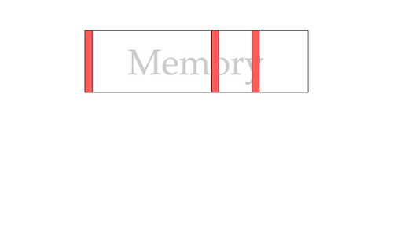
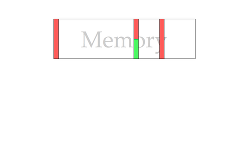
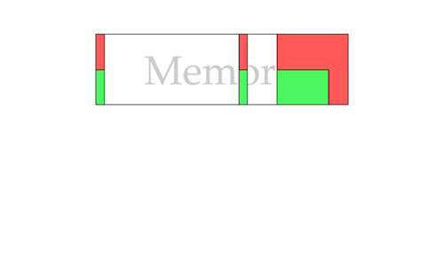
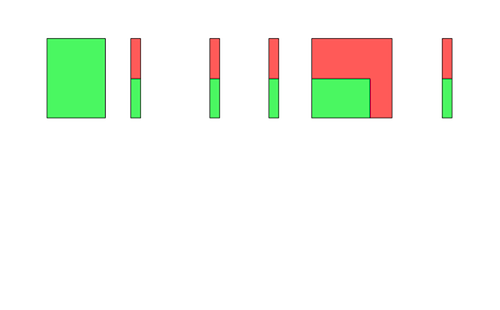
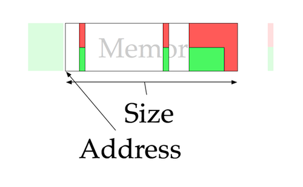
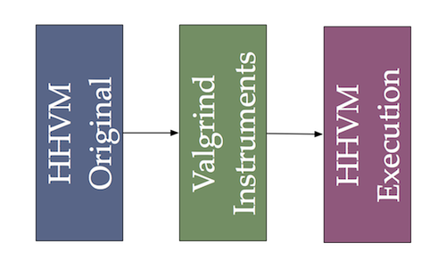

% An Analysis of Memory Management in HipHopVM
% Benjamin Roberts, Nathan Yong, Jan Zimmer
% HHVM Group, Summer Research Scholarship 2013/14

#What is a HipHopVM?

##Background
 - HipHopVM is an Free and Open Source PHP engine
 - Written primarily in C++ with moderate amounts of PHP and x86_64 assembly
 - It uses a JIT compiler (though historically it translated PHP to C++ for AOT compilation)
 - It is the PHP engine designed by and which hosts Facebook
 - Its on GitHub! [https://github.com/facebook/hhvm][hhvm_github]

##Our Tasks
 - To isolate the affect of naive reference counting on HHVM's performance
 - To observe how memory access maps to actual physical memory access
 - NATHAN

----------------------

Before continuing we will briefly introduce some relevant concepts

#Internals of HHVM

##Reference Counting in the PHP language
 - Based on explicit garbage collection (reference counting)
 - Required by language semantics
 - PHP is **pass by value**
 - Pass by value can be slow due to large amount of copies (especially with large arrays)
 

-----------------------

 - Solution: Copy on Write!
 - Problem: Need to know current reference count
 - Each mutation requires immediate increment and decrement of reference counts
 - Advantage: Immediate garbage reclamation
 - **This requirement will cause us major problems shortly**
 

##Reference Counting in HHVM (C++)
 - Reference counted objects have an `int_32t m_count` field and call a macro in [countable.h][countable.h] containing various reference counting operations (`incRefCont()`, `hasMultipleRefs()`, `decRefAndRelease()` etc)
 - Not consistently used (certain places directly mutate `m_count` or define separate ref-counting methods)
 - Difficult to track down all mutations of `m_count`

##Reference Counting in HHVM (JIT)
 - `int_32t m_count` at a common offset (12 bytes) in all refcounted objects
 - Several opcodes emit reference counting assembly via the JIT
 - Intermediate Representation is optimised to remove inc/dec pairs where safe to do so
 - Simpler to locate, more difficult to understand
 
--------------------
 
**Both these systems are implemented independent of each other (`m_count` and destructors shared) and the memory manager**
 
##Memory Management
 - MENTION REQUEST LOCAL ETC, REQUIRED FOR CONTEXT LATER ON
 
##OTHER

#HHVM Without Reference Counting (Benjamin Roberts)

##HHVM Without Reference Counting
 - Who needs reference counts? (besides the PHP semantics)
 - If we are freeing our heap at the end of request, why do we need immediate reclamation?
 - Lets try nail down the performance penalty of immediate reference counting.

##Lets Modify HHVM 
Removed/Disabled 3 forms of reference counting to create [hhvmnocount][hhvmnocount]:
 
 - [countable.h][countable.h] functions
 - JIT emitted reference counting
 - Various manual mutations and re-implementations (this took a while)
 
 -----------------
 
 - Compared to regular HHVM, [hhvmnocount][hhvmnocount] was much slower
 - Completely different memory usage characteristics
 - Hand't yet isolated the effects of reference counting

##Continuos Allocation
In order to isolate the effects of reference counting a modified memory manager was used:

 - Memory Manager no longer freed memory, No longer used free lists
 - Large objects no longer special case
 - Memory not freed at requests end
 - Objects still _'sweeped'_ due to unreclaimed File and Database objects causing errors.
 
 -----------------
 
 - Resulted in the [hhvmbump][hhvmbump] and [hhvmbumpnocount][hhvmbumpnocount] branches.
 - Reference counting was now isolated, time to run some tests.
 
##Benchmark Setup
 - Due to the nature of the changes, it was difficult to find representative PHP packages that ran on all builds
 - A modified version of a benchmark included in HHVM ([center-of-mass.php][center-of-mass.php]) was chosen due to its heavy memory usage 
 - [center-of-mass.php][center-of-mass.php] is unlikely to represent the average PHP request but was the only test with sufficient memory usage for benchmarking
 
------------------ 

The configuration used for benchmarking:

 - Linux kernel version: 3.12.6-300.fc20.x86_64
 - CPU: Intel(R) Core(TM) i7-3770 CPU @ 3.40GHz
 - Memory: 4x4G DDR3 memory at 1600MHz (no swap partiton)
 - internal ssd for HHVM builds
 - Release configuration
 - Appache Benchmark (ab) with various levels of concurrency and test lengths
 
##Results:
 - Results were graphed as surfaces using Matlab
 - All results are graphed against total requests and concurrent-requests
 - [hhvmnocount][hhvmnocount] is omitted from the results due to segmentation faults in Release configuration
 
##Percentage Response Times (milliseconds, lower is better)

-----------------

 - The lower 20% of response times are dependant on the build and the number of concurrent requests
 - Small sample size, not very representative
 
 ----------------
 

-----------------

 - Most interesting of the percentage response graphs
 - Shows that [hhvmbumpnocount][hhvmbumpnocount] performs the worst in majority of runs.
 - This is contrary to expectations as it should have performed **less** operations than [hhvmbump][hhvmbump]
 - Will be discussed shortly

-----------------

-----------------

 - Large sample size now starting to include long-response times from warm-up period
 - A lot of noise
 - Still shows, like the previous graph, that [hhvmbumpnocount][hhvmbumpnocount] performs the worst.
  
##Requests Processed per Second (higher is better)

------------------

 - This graph shows that the removal of reference counting incurs a notable request processing penalty
 - Penalty very noticeable in longer benchmark runs

##Total Execution Time

------------------

- Again shows that the removal of reference counting results in longer execution times

##Why Did This Happen?
 - Remains uncertain
 - Benchmark chosen not representative of real PHP workload?
 - Copy on Write behaviour?
 
##Copy on Write
 - As previously mentioned, copy on write requires exact reference counts
 - ArrayData and StringData mutation behaviour based on the `hasMultipleRefs()` call (which is inaccurate in [hhvmbumpnocount][hhvmbumpnocount] build)
 - Over zealous copying may have occurred on mutation, resulting in performance penalty
 - Could be confirmed by profiling and comparing memory usage of [hhvmbump][hhvmbump] and [hhvmbumpnocount][hhvmbumpnocount]
 
##Further Work
Due to time constraints, several questions and problems remain unsolved:

 - Identify source of negative result
 - Re-run benchmark with Copy on Assignment semantics (potential method for previous point)
 - Benchmark true request based GC (This was attempted early on before focus shifted to reference counting)
 - Analyse the relationship between memory usage and response time (these modifications begin make memory a player in processing bottlenecks) 

#Physical Memory Profile (Jan Zimmer)

##Physical Memory Profile
- Memory utilization

----------------

- Memory utilization

----------------

- Memory utilization

----------------

- Memory utilization

----------------

- Memory utilization

----------------

- Memory utilization

----------------

- What HHVM can give us

----------------

- What Valgrind can give us

----------------

- What Valgrind and HHVM can give us

----------------

- How they actually fit together

----------------

- How they actually fit together

----------------

- How they actually fit together

----------------

- 

- Tool: Valgrind
  - Get Memory Sectors from HHVM
  - Monitor memory loads and stores from valgrind
  - Valgrind a little too powerful
- Future

#NATHAN TASK (Nathan Yong)

##NATHAN TASK

#Conclusion and Further Work

[render_command]: pandoc -t beamer presentation.md -V theme:Warsaw -o presentation.pdf
[references]: below
[hhvm_github]: https://github.com/facebook/hhvm

[code_references]: below
[countable.h]: https://github.com/TsukasaUjiie/hhvm/blob/master/hphp/runtime/base/countable.h
[center-of-mass.php]: https://github.com/TsukasaUjiie/srs-hhvm-notebook/blob/master/refcount_analysis/benchmarks/center-of-mass.php

[repo_branches]: below
[inconsistant_refcounting_commit]: https://github.com/TsukasaUjiie/hhvm/commit/8ed7fcac87a3b9dc9d07078a619c2db1506089b4
[norefcount-master-compare]: https://github.com/TsukasaUjiie/hhvm/compare/master...consistant_refcounting#diff-346a8263f676cff3a20324eb9fb34231R4199
[hhvmclean]: https://github.com/TsukasaUjiie/hhvm/tree/master
[hhvmnocount]: https://github.com/TsukasaUjiie/hhvm/tree/consistant_refcounting
[hhvmbump]: https://github.com/TsukasaUjiie/hhvm/tree/master-bumppoint
[hhvmbumpnocount]: https://github.com/TsukasaUjiie/hhvm/tree/bump-point-no-refcounting

