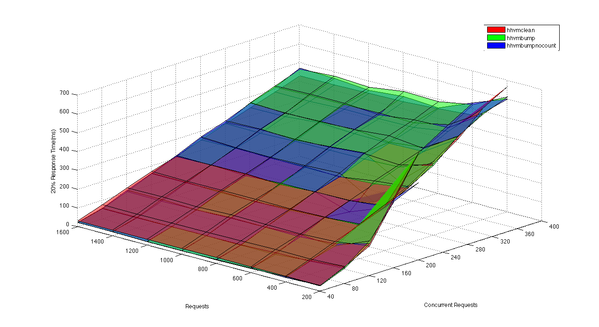
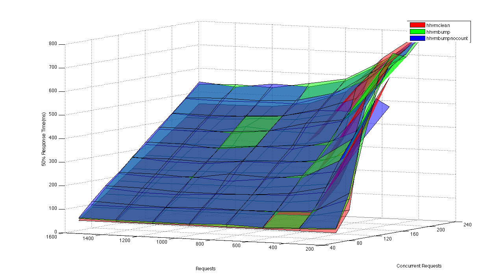
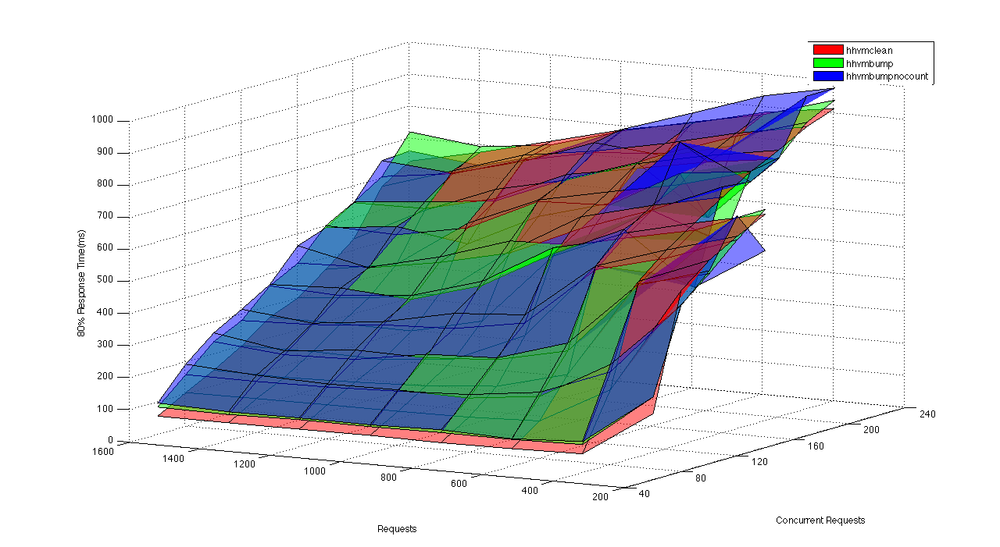
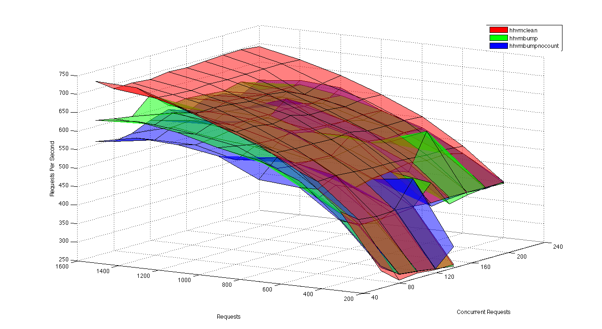
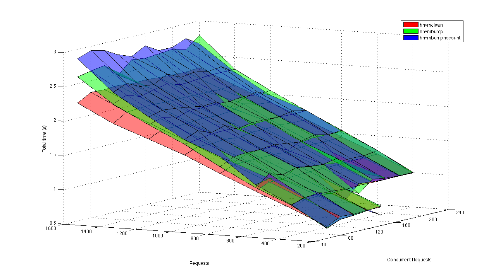

% An Analysis of Memory Management in HipHopVM
% Benjamin Roberts, Nathan Yong, Jan Zimmer
% HHVM Group, Summer Research Scholarship 2013/14

#Background
HipHopVM is an Free and Open Source PHP engine written primarily in C++, with moderate amounts of PHP and x86_64 assembly, totalling approximately 1.2 million lines of code. It uses a Just In Time compiler, though historically it translated PHP to C++ for ahead of time compilation. It is the primary PHP backend used on Facebook's infrastructure.

#Our Tasks
Our specific tasks as part of the ANU Summer Research Scholarship were to:
 - To isolate the affect of naive reference counting on HHVM's performance (Benjamin Roberts)
 - To observe how memory access maps to actual physical memory access (Jan Zimmer)
 - To map and analyse the behaviour of HHVM's internal memory management (Nathan Yong)
 
##HHVM Without Reference Counting (Benjamin Roberts)
When using an allocator which free's all allocated memory at request end (such as that used in HHVM), the immediate reclamation provided by naive reference counting become less attractive. Whilst the semantics of the PHP language enforce the use of naive reference counting we can still try to analyse its impact.

A modified version of HipHopVM ([hhvmnocount][hhvmnocount]) was created in which reference counting operations (such as those in [countable.h][countable.h], the JIT and various direct manipulations) were removed. When compared to a clean build of HHVM this modified version ran much slower due to wildly different memory usage characteristics; the clean build was able to reuse free'd memory through its Memory Manager whilst [hhvmnocount][hhvmnocount] continuously allocated new memory.

In order to isolate the effects of reference counting the memory manager was modified. These modifications include:

- Disabling of memory freeing (even at requests end)
- Removing of free list based allocator
- Single case treatment for all object sizes

The 'sweeping' of memory (a process usually performed before their freeing to de-alocate any self-managed memory) was still preformed as, without it, assets like databases and files became unusable (due to too many instances). These modifications resulted in the [hhvmbump][hhvmbump] and [hhvmbumpnocount][hhvmbumpnocount] builds.

##Benchmark Setup
- Due to the nature of the changes, it was difficult to find representative PHP packages that ran on all builds
- A modified version of a benchmark included in HHVM ([center-of-mass.php][center-of-mass.php]) was chosen due to its heavy memory usage 
- [center-of-mass.php][center-of-mass.php] is unlikely to represent the average PHP request but was the only test with sufficient memory usage for benchmarking

------------------ 

The configuration used for benchmarking:

- Linux kernel version: 3.12.6-300.fc20.x86_64
- CPU: Intel(R) Core(TM) i7-3770 CPU @ 3.40GHz
- Memory: 4x4G DDR3 memory at 1600MHz (no swap partiton)
- internal ssd for HHVM builds
- Release configuration
- Apache Benchmark (ab) with various levels of concurrency and test lengths

##Results:
- Results were graphed as surfaces using Matlab
- All results are graphed against total requests and concurrent-requests
- [hhvmnocount][hhvmnocount] is omitted from the results due to segmentation faults in Release configuration

##Percentage Response Times (milliseconds, lower is better)

-----------------

- The lower 20% of response times are dependant on the build and the number of concurrent requests
- Small sample size, not very representative

----------------

-----------------

- Most interesting of the percentage response graphs
- Shows that [hhvmbumpnocount][hhvmbumpnocount] performs the worst in majority of runs.
- This is contrary to expectations as it should have performed **less** operations than [hhvmbump][hhvmbump]
- Will be discussed shortly

-----------------

-----------------

- Large sample size now starting to include long-response times from warm-up period
- A lot of noise
- Still shows, like the previous graph, that [hhvmbumpnocount][hhvmbumpnocount] performs the worst.

##Requests Processed per Second (higher is better)

------------------

- This graph shows that the removal of reference counting incurs a notable request processing penalty
- Penalty very noticeable in longer benchmark runs

##Total Execution Time

------------------

- Again shows that the removal of reference counting results in longer execution times

##Why Did This Happen?
- Remains uncertain
- Benchmark chosen not representative of real PHP workload?
- Copy on Write behaviour?

##Copy on Write
- As previously mentioned, copy on write requires exact reference counts
- ArrayData and StringData mutation behaviour based on the `hasMultipleRefs()` call (which is inaccurate in [hhvmbumpnocount][hhvmbumpnocount] build)
- Over zealous copying may have occurred on mutation, resulting in performance penalty
- Could be confirmed by profiling and comparing memory usage of [hhvmbump][hhvmbump] and [hhvmbumpnocount][hhvmbumpnocount]

##Further Work
Due to time constraints, several questions and problems remain unsolved:

- Identify source of negative result
- Re-run benchmark with Copy on Assignment semantics (potential method for previous point)
- Benchmark true request based GC (This was attempted early on before focus shifted to reference counting)
- Analyse the relationship between memory usage and response time (these modifications begin make memory a player in processing bottlenecks) 
- Preserve copy-on-write behaviour without reference counting

[render_command]: pandoc report.md -o report.pdf
[references]: below
[hhvm_github]: https://github.com/facebook/hhvm

[code_references]: below
[countable.h]: https://github.com/TsukasaUjiie/hhvm/blob/master/hphp/runtime/base/countable.h
[center-of-mass.php]: https://github.com/TsukasaUjiie/srs-hhvm-notebook/blob/master/refcount_analysis/benchmarks/center-of-mass.php

[repo_branches]: below
[inconsistant_refcounting_commit]: https://github.com/TsukasaUjiie/hhvm/commit/8ed7fcac87a3b9dc9d07078a619c2db1506089b4
[norefcount-master-compare]: https://github.com/TsukasaUjiie/hhvm/compare/master...consistant_refcounting#diff-346a8263f676cff3a20324eb9fb34231R4199
[hhvmclean]: https://github.com/TsukasaUjiie/hhvm/tree/master
[hhvmnocount]: https://github.com/TsukasaUjiie/hhvm/tree/consistant_refcounting
[hhvmbump]: https://github.com/TsukasaUjiie/hhvm/tree/master-bumppoint
[hhvmbumpnocount]: https://github.com/TsukasaUjiie/hhvm/tree/bump-point-no-refcounting
