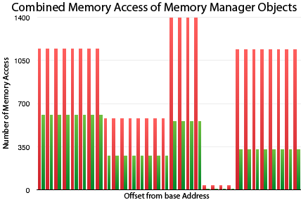
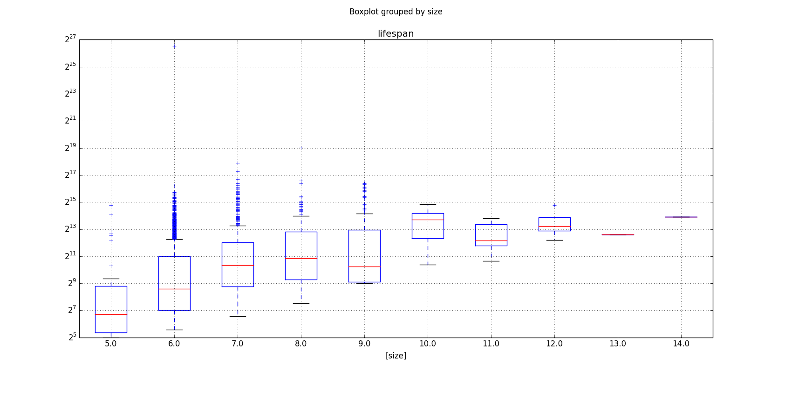
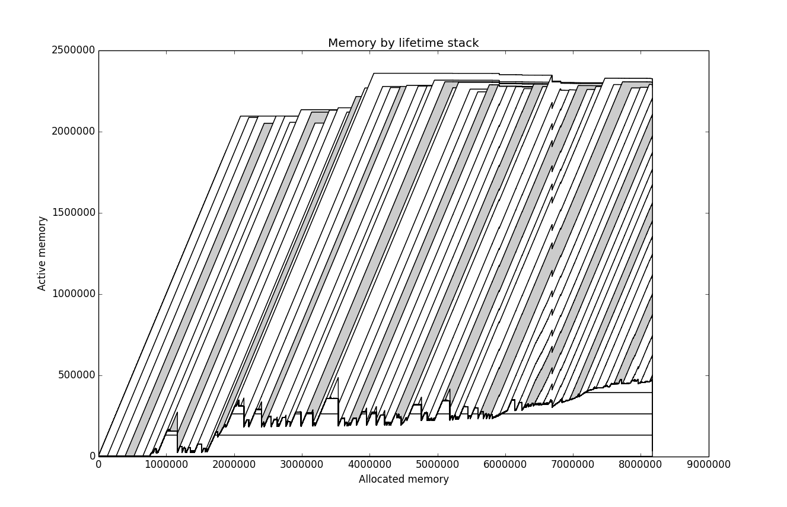

% An Analysis of Memory Management in HipHopVM
% Benjamin Roberts, Nathan Yong, Jan Zimmer
% HHVM Group, Summer Research Scholarship 2013/14

#Background
HipHopVM is an Free and Open Source PHP engine written primarily in C++, with moderate amounts of PHP and x86_64 assembly, totalling approximately 1.2 million lines of code. It uses a Just In Time compiler, though historically it translated PHP to C++ for ahead of time compilation. It is the primary PHP backend used on Facebook's infrastructure.

#Our Tasks
Our specific tasks as part of the ANU Summer Research Scholarship were to:
 - To isolate the affect of naive reference counting on HHVM's performance (Benjamin Roberts)
 - To observe how memory access maps to actual physical memory access (Jan Zimmer)
 - To map and analyse the behaviour of HHVM's internal memory management (Nathan Yong)

##HHVM Without Reference Counting (Benjamin Roberts)
When using an allocator which free's all allocated memory at request end (such as that used in HHVM), the immediate reclamation provided by naive reference counting become less attractive. Whilst the semantics of the PHP language enforce the use of naive reference counting we can still try to analyse its impact.

A modified version of HipHopVM ([hhvmnocount][hhvmnocount]) was created in which reference counting operations (such as those in [countable.h][countable.h], the JIT and various direct manipulations) were removed. When compared to a clean build of HHVM this modified version ran much slower due to wildly different memory usage characteristics; the clean build was able to reuse free'd memory through its Memory Manager whilst hhvmnocount continuously allocated new memory.

In order to isolate the effects of reference counting the memory manager was modified. These modifications include:

- Disabling of memory freeing (even at requests end)
- Removing of free list based allocator
- Single case treatment for all object sizes

The 'sweeping' of memory (a process usually performed before their freeing to deallocate any self-managed memory) was still preformed as, without it, assets like databases and files became unusable (due to too many instances). These modifications resulted in the [hhvmbump][hhvmbump] and [hhvmbumpnocount][hhvmbumpnocount] builds.

These modified builds were unable to run standard PHP applications (such as the Wordpress CMS). As such a modified version of an included HHVM benchmark ([center-of-mass.php][center-of-mass.php]). While it does not accurately represent a standard PHP request it does make heavy usage of the memory subsystems. The configuration used for benchmarking was:

- Linux kernel version: 3.12.6-300.fc20.x86_64
- CPU: Intel(R) Core(TM) i7-3770 CPU @ 3.40GHz
- Memory: 4x4G DDR3 memory at 1600MHz (no swap partiton)
- Internal SSD for HHVM builds
- Release configuration
- Apache Benchmark (ab) with various levels of concurrency and test lengths
- Results graphed using Matlab
- All sources and results available [here][srs_notebook]

###Results
")

")

")

Unfortunately due to segmentation faults in Release mode: hhvmnocount was omitted from the following graphs.

Figure 1 shows that the hhvmbumpnocount build, which logically should have performed the least operations due to its lack of reference counting, performed consistently worse than hhvmbump.

Figures 2 and 3 show respectively that hhbmbump no count processed the least requests per second and took overall the longest amount of time to execute the benchmarks.

###Analysis
This data was gathered late in the project timeline so the following analysis is fairly rough. As previously mentioned the benchmark used is not representative of regular PHP workloads. Another issue is potentially incorrect application of the PHP copy-on-write behaviour in builds lacking reference counting.

The copy on write behaviour of php objects requires classes such as ArrayData and StringData to behave differently on mutation when referenced multiple times. Based on the call `hasMultipleRefs()` these classes will either copy themselves (when call returns true) before mutation to preserve assign-by-value semantics or mutate in place (when call returns false). In hhvmnocount and hhvmbumpnocount this call returns incorrect values; perhaps leading to over zealous copying of arrays and therefore performance penalties. This has not yet been tested but could easily be done by comparing the memory usage of the nocount builds against hhvmbump (which preserves copy-on-write behaviour).

###Further Work
Due to time constraints, several questions and problems remain unsolved:

 - The cause of the described negative result (performance penalty resulting from reference count removal).
 - Re-run benchmark with copy on assignment semantics (as a possible solution to the above problem).
 - Benchmark the performance of a pure request based memory manager (where no freeing occurs mid request). This was attempted early on with promising results before focus changed.
 - Analyse the relationship between memory usage and response time as these modifications introduce memory as a potential performance bottleneck.
 - Preserve the copy-on-write semantics of PHP whilst removing exact reference counting.

##Analyzing Memory Accesses (Jan Zimmer)
All memory must end somewhere. But how is it accessed?

The goal of this task was to analyze memory access within the vm's representation of the php objects. This was to be achieved by tracking down where the actual php objects become created within hhvm, and then use Valgrind to record memory loads and stores to the memory block where the php object got created.

This analysis can then be used to optimize for frequently accessed sectors, or optimization of sectors which aren't used anymore.

To do this, flags were inserted into the smart memory manager of HHVM to log all creations and destructions of objects and their corresponding address ranges. Valgrind was then simultaneously logging all load and stores of memory and their corresponding addresses. These two logs were interleaved and written to the same log file for synchronization.

A parser was then written go over the log file, and actually record on a per object basis, how many reads and writes happened at different offsets to the object addresses. This approach however underwent several issues which in the end failed to make it usable, as will be mentioned below.

[The parser tool](https://github.com/TsukasaUjiie/srs-hhvm-notebook/tree/master/valgrind-tools/lackey_parser).

###Results

_Disclaimer, these results are not yet representative of HHVM's actual behavior as the tool is not in working condition_

As a demonstration what a tool like this might be able to produce, the tool was run over the center-of-mass benchmark, and filtered to any objects of 32 bytes in length, but as the tool still has no other filtering method, it is unknown whether these were php objects, and if they were, what kind of php objects they were.

Potential analysis which could be taken from something like this are:

- The virtual machine appears to execute a lot more stores than loads on the memory.
- The memory sectors with offset 20-23 appear to be only rarely used, possibly due to changes in the hhvm data structures which no longer use that

###Issues
The current workflow extracts the addresses of objects to monitor by printing them out from the HHVM code. And the addresses of accessed memory sectors are printed during the Valgrind's interpretation of the HHVM code. However, these two things are not actually executed in parallel, but are executed alternately. For efficiency reasons in Valgrind, it will interpret multiple instructions in one block and then execute them in one block instead of alternating after every single instruction.
The problem which is encountered by this is that during a call to create an object, Valgrind will first interpret that instruction, but due to the complexity of extracting specific memory sector content out of Valgrind, this will not produce anything in the logs. Several accesses to that location happen which are observed but are not regarded as relevant yet. Before the block of execution comes to an end, it is deallocated again.
The end effect of all of this is that Valgrind ignores all memory accesses to that memory location as it hasn't been specifically told during the HHVM execution to monitor those memory addresses. And as the object has also already been deallocated before having been told about it in the first place, Valgrind will have missed all memory access.
It unfortunately is not a possibility to offset the two logs cleverly to overlap properly as it is common for the same memory address to become allocated and deallocated multiple times within the same block, and then even an offset won't be able to tell which memory accesses pertain to which particular version of the object.

###Further Work
What the project still needs:

- Actual filtering of different objects so we don't record the objects of the c++ vm as well
- Potential further filtering between different php primitives
- A Valgrind tool capable of detecting which sectors to monitor from within Valgrind's Intermediate-Representation and replacing the need for any large log files.

##Visualising the Behaviour of the Smart Memory Manager (Nathan Yong)
HHVM's Smart Memory Manager is a hybrid memory manager, managing its blocks via a free list, but being backed by a 'reap' (region-heap), which, as discussed above, frees its memory after every request. However, in a similar theme to the reference counting API, the usage of the smart memory manager API (which is simple in itself) is also wildly varied and inconsistent.

In addition to this, the usage of the smart memory manager has grown to the point where its behaviour becomes non-trivial, and it is used not only for storing PHP objects, but also C++ objects used in for the VM's own purposes. 

Analysis of the memory manager was done by annotating all important smart memory manager functions with calls to a logging function, which would then calculate block lifetimes and output information about allocations and deallocations. The relevant smart memory manager function would also be logged, which could be used to reason about how much of the heap is being used by which parts of the virtual machine. 

Initially, the CSV output of the patch was analysed using the R language, but ultimately [Python scripts][analysis.py] were used to do some more advanced parsing of the log file in order to determine, for example, the average lifetime of a block of memory. The graphs were inspired by the graphs in the [DaCapo Benchmarks paper][dacapo], which showed the average lifetime of blocks of memory, as well as the structure of the heap at any time.

###Graphs

In the first graph, functions with 'size' in then are internal functions which did not allocate a sweep header. Despite being internal functions, they were often called directly to allocate object storage space. 

The second graph is a box plot of the different lifespans of an object within one request. Note that the x axis denotes the size in bytes, in powers of two. 

The last graph shows allocated memory against active memory, as a function of bytes. Different 'slices' of memory could be tracked as a function of memory allocated, however this data was generated using a Python script, rather than being written by HHVM, in order to make calculation easier.

###Issues
Annotating every instance of a `malloc` call or similar would have been far too time-consuming and potentially inefficient, so only key functions within the smart memory manager were instrumented. A similarly revealing approach would have been to instrument a `malloc` library directly, however this ran into complications after HHVM appeared to depend on specific `jemalloc` library behaviour.

In a similar vein, since the annotations existed only inside the smart memory manager, it was difficult to extract what each block of memory was being used for. A method to hint the logger about the intent of each block of memory was developed, but ran into complications due to not being thread-local, unlike the memory manager. Because HHVM is multithreaded, this made collecting data for more than one thread increasingly difficult. An attempt was made at incorporating the logger directly into the memory manger, but this would have made it impossible to record allocations done outside the memory manager, for example inside the `HPHP::Util` namespace. 

###Further Work
The obvious step from here would be to make the logger thread-capable by changing the mechanism into being a thread-local singleton, similar to the smart memory manager. Information and annotations from this tool would also be useful to Jan Zimmer's analysis, and perhaps eventually the two would be combined. 

Eventually, the patch could be incorporated into a detailed heap profiling toolset that would be aware of HHVM's own internal workings and shed more light on what the smart memory manager is being used for. Likewise, the Python scripts could be changed into a proper analysis tool, for at the moment they are still in the realm of exploratory statistics. 

[render_command]: pandoc report.md -o report.pdf
[references]: below
[hhvm_github]: https://github.com/facebook/hhvm
[srs_notebook]: https://github.com/TsukasaUjiie/srs-hhvm-notebook

[code_references]: below
[countable.h]: https://github.com/TsukasaUjiie/hhvm/blob/master/hphp/runtime/base/countable.h
[center-of-mass.php]: https://github.com/TsukasaUjiie/srs-hhvm-notebook/blob/master/refcount_analysis/benchmarks/center-of-mass.php

[repo_branches]: below
[inconsistant_refcounting_commit]: https://github.com/TsukasaUjiie/hhvm/commit/8ed7fcac87a3b9dc9d07078a619c2db1506089b4
[norefcount-master-compare]: https://github.com/TsukasaUjiie/hhvm/compare/master...consistant_refcounting#diff-346a8263f676cff3a20324eb9fb34231R4199
[hhvmclean]: https://github.com/TsukasaUjiie/hhvm/tree/master
[hhvmnocount]: https://github.com/TsukasaUjiie/hhvm/tree/consistant_refcounting
[hhvmbump]: https://github.com/TsukasaUjiie/hhvm/tree/master-bumppoint
[hhvmbumpnocount]: https://github.com/TsukasaUjiie/hhvm/tree/bump-point-no-refcounting

[dacapo]: http://users.cecs.anu.edu.au/~steveb/downloads/pdf/dacapo-oopsla-2006.pdf
[analysis.py]: https://github.com/TsukasaUjiie/srs-hhvm-notebook/blob/master/mm_instrumentation/visualisation.ipynb
